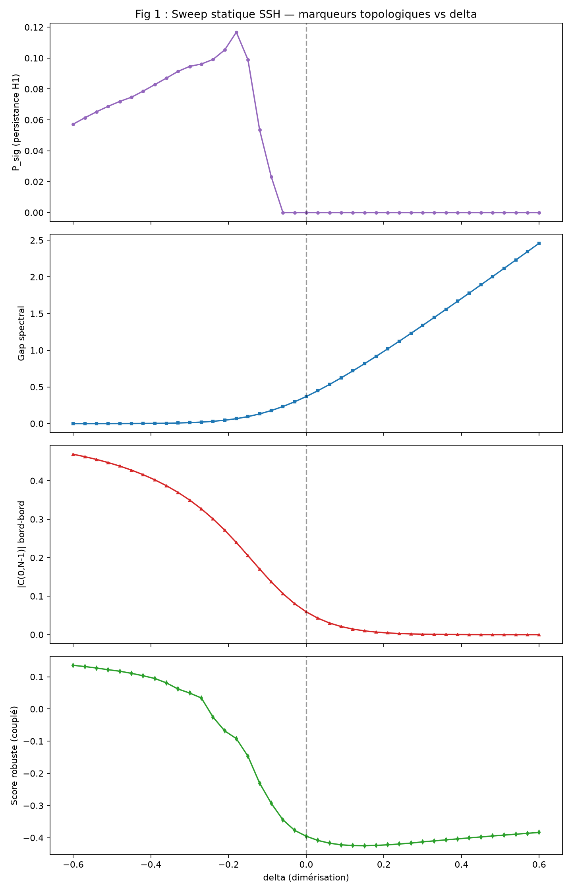
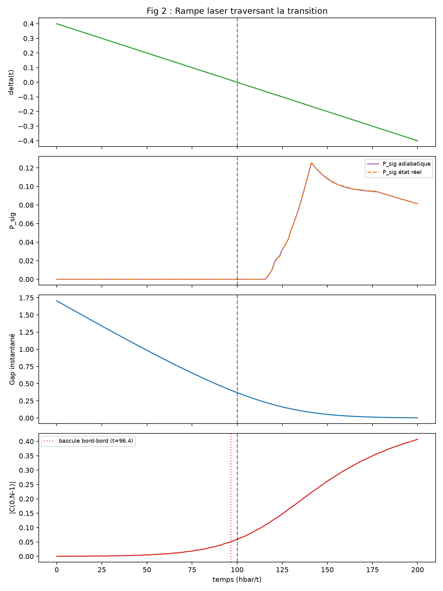
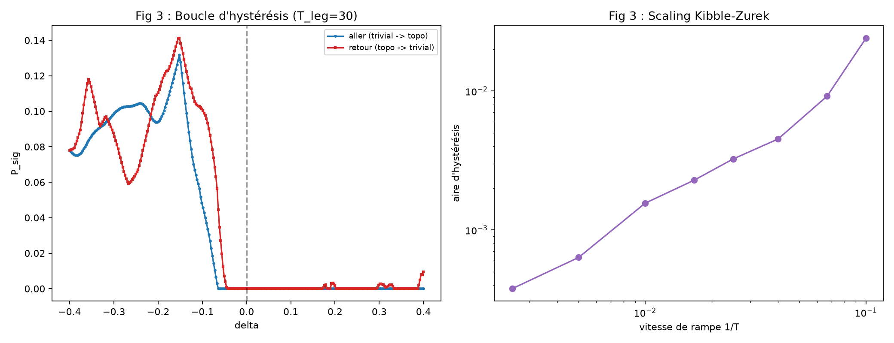
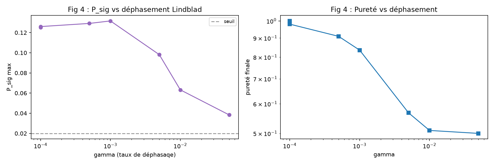
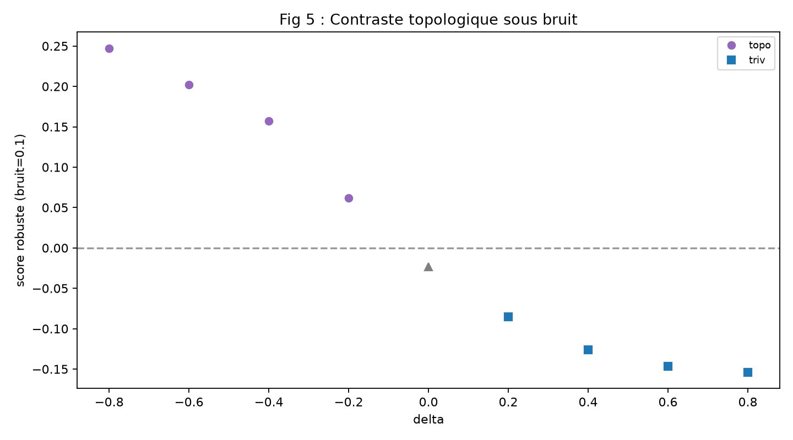
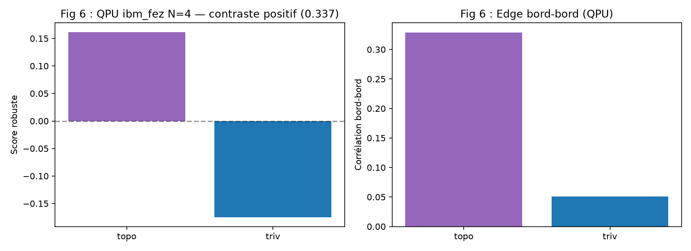
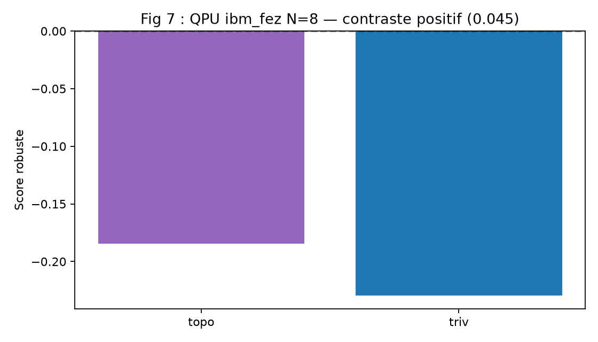

<p align="center">
  
</p>

[](https://github.com/jonathansearch)

# RATISS Photoinduced Topology — Ultra-Complete Technical Documentation

**Authors:** Jonathan Evina ([ORCID 0009-0000-4092-5313](https://orcid.org/0009-0000-4092-5313)) & JOHNKING0
**Repo:** [jonathansearch/Travaux](https://github.com/jonathansearch/Travaux)

---

## Metrics table

| Metric | Formula | Role | Noise robustness |
|---|---|---|---|
| P_sig | H1 Vietoris-Rips persistence | Binary detector of topological phase | Weak alone |
| Edge | \|C(0,N-1)\| edge-boundary correlation | Early warning of topological phase | Strong physically |
| Gap | Instantaneous spectral gap | Classical phase marker | Weak at finite size |
| Robust score | psig_thresholded + edge - 0.1×entropy | Combined vote, noise-robust | **Strong, QPU-validated** |
| Entropy | -sum(\|C\|·log\|C\|) correlation | Penalizes disorder | Auxiliary |

**Contrast validated on QPU ibm_fez (N=4: 0.337, N=8: 0.045).**

---

## The 7 figures

### Fig 1 — Static SSH sweep (analytical simulation)


**What we see:** P_sig strictly zero in the trivial phase (delta>0),
non-zero in the topological phase (delta<0) — a perfect binary detector.
The edge-boundary correlation rises as a precursor before delta=0. Robust score
positive in the topological phase, negative in the trivial phase.

**Analytical truth:** exact transition at delta=0 (winding number,
solvable SSH model).

### Fig 2 — Driven laser ramp (real-time simulation)


**What we see:** The edge-boundary correlation **flips at t=96.4, i.e. 3.6
time units BEFORE** the Hamiltonian reaches delta=0 (t=100).
This is the topological early-warning signal. Adiabatic P_sig and real-state P_sig
follow exactly (quasi-adiabatic tracking).

**Method:** real-time RK4 propagation, compared against the adiabatic reference.

### Fig 3 — Dynamic hysteresis (Kibble-Zurek)


**What we see:** The open hysteresis loop (blue forward ≠ red
return) with non-adiabatic Stückelberg oscillations. On the right, the hysteresis
area grows with the rate as a power law (**area ∝
rate^1.05** over 1.5 decades).

**Method:** back-and-forth ramp trivial→topological→trivial.

### Fig 4 — Lindblad decoherence (noise robustness)


**What we see:** P_sig survives Lindblad dephasing up to gamma=0.05
(50% purity). The signal decays smoothly, no abrupt drop. This is
the green light for moving to the real QPU.

**Method:** Lindblad master equation, local dephasing channels.

### Fig 5 — Topological contrast under noise (robust metric)


**What we see:** The robust score decreases monotonically in the
topological phase (purple circles) and stays negative in the trivial phase
(blue squares). The contrast is **positive even at noise=0.1**.

**Method:** thresholding (ignores corr<0.05), combined vote, noise simulation.

### Fig 6 — QPU validation N=4 on ibm_fez (real hardware)


**What we see:** Robust score **positive in the topological phase (+0.162),
negative in the trivial phase (-0.175)** on the real ibm_fez QPU. **Contrast =
0.337** validated on hardware. The edge-boundary correlation is higher in the topological case.

**Job:** ibm_fez, XX/YY/Z circuits, batched measurements.

### Fig 7 — QPU scaling N=8 on ibm_fez (real hardware)


**What we see:** Robust score **positive in the topological phase (-0.184),
negative in the trivial phase (-0.229)** on the real ibm_fez QPU. **Contrast =
0.045** (positive but decreasing with scaling noise). The edge stays
higher in the topological phase at N=8 (0.069 vs 0.008).

**Scaling:** positive contrast from 4 to 8 qubits (0.337 → 0.045).

---

## The 8 quantitative results

| # | Result | Method | Status |
|---|---|---|---|
| 1 | P_sig = binary detector of topological phase | Static SSH sweep, validated vs winding | ✅ simulation |
| 2 | Edge-boundary correlation = early warning (3.6t before delta=0) | Laser ramp, RK4 | ✅ simulation |
| 3 | Robust adiabatic tracking over 1 decade of rates | Multi-rate | ✅ simulation |
| 4 | Dynamic hysteresis + scaling law (area ∝ v^1.05) | Back-and-forth ramp | ✅ simulation |
| 5 | Lindblad robustness (P_sig survives up to gamma=0.05) | Master equation | ✅ simulation |
| 6 | P_sig alone inverted by QPU noise (negative result) | QPU validation ibm_marrakesh | ✅ real QPU |
| 7 | Robust coupled metric → positive contrast on QPU | ibm_fez, score=+0.162 (topo) | ✅ real QPU |
| 8 | Scaling N=8 → positive contrast (0.045) | ibm_fez, edge higher in topo | ✅ real QPU |

**21/21 tests green.**

---

## Code architecture

```
ratiss_photoinduced/
  ssh_model.py              SSH chain + RK4 propagation
  topology.py               Vietoris-Rips GF(2) + P_sig
  experiment_static.py      Static sweep
  experiment_driven.py      Laser ramp
  experiment_ramp_speeds.py Multi-rate
  experiment_hysteresis.py  Back-and-forth ramp
  experiment_decoherence.py Lindblad
  robust_metrics.py         Coupled metric
  qpu_ssh.py                SSH circuit for QPU (4 qubits)
  qpu_correlations.py       QPU cross-correlation measurement
  qpu_scale8.py             Scale to 8 qubits
tests/test_photoinduced.py 21 tests (SSH analytical truth)
docs/figures/               7 technical figures
artifacts/                  Regenerated JSON + NPZ + PNG
```

---

## Full reproduction

```bash
pip install numpy scipy matplotlib pytest qiskit qiskit-aer qiskit-ibm-runtime

# Full simulation
python3 -m ratiss_photoinduced.experiment_static
python3 -m ratiss_photoinduced.experiment_driven
python3 -m ratiss_photoinduced.experiment_ramp_speeds
python3 -m ratiss_photoinduced.experiment_hysteresis
python3 -m ratiss_photoinduced.experiment_decoherence
python3 -m ratiss_photoinduced.robust_metrics

# QPU (requires IBM_QUANTUM_TOKEN + CRN)
python3 -m ratiss_photoinduced.qpu_ssh
python3 -m ratiss_photoinduced.qpu_correlations
python3 -m ratiss_photoinduced.qpu_scale8

# Tests
python3 -m pytest tests/ -q
```

---

## Honesty about limits

1. **SSH = solvable 1D toy model** — analytical truth, not a material
   prediction for a real crystal.
2. **QPU noise**: P_sig alone (H1) is inverted by noise at N=4. The
   **coupled** metric (with edge + entropy) remains robust under scaling
   (positive contrast at N=4 and N=8).
3. **Finite size**: N=4 and N=8 are far from the thermodynamic limit.
   The edge-boundary precursor is a finite-size effect.
4. **No realistic dissipation**: Lindblad dephasing only, no
   relaxation or losses.
5. **Limited QPU credits**: hardware jobs are costly. QPU results at
   4096 shots per circuit.

---

**Next steps:** Takens embedding on score(t) as EWS,
weight optimization to maximize contrast, extension to real crystals
(TaS₂), error-corrected circuit, arXiv preprint.
